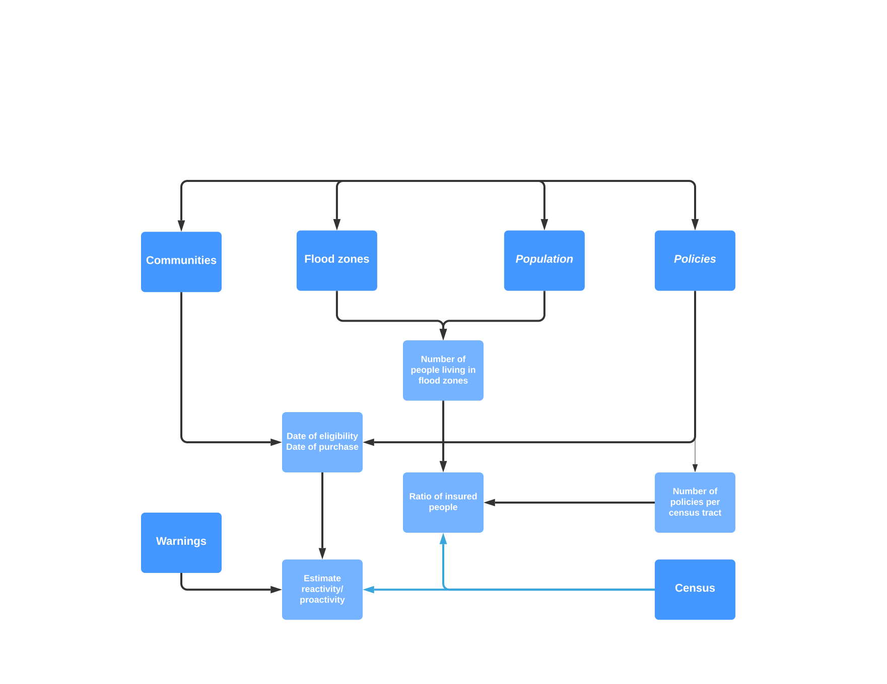

# NFIP
## Data mining project to answer the question: 
### What enables households to a realistic/rational risk perception and self determined improvement in resilience?
 
# Data sources

The following open data sources are used in this project:

### FEMA Flood Map Service Center

https://msc.fema.gov/portal/home

### Communities eligible for the NFIP

https://www.fema.gov/flood-insurance/work-with-nfip/community-status-book 

### American CENSUS data

https://walker-data.com/tidycensus/articles/basic-usage.html

### Tigris shapefiles

https://www.rdocumentation.org/packages/tigris/versions/1.0

### Claims and policies from NFIP

https://www.fema.gov/openfema-data-page/fima-nfip-redacted-claims-v1#
https://www.fema.gov/openfema-data-page/openfema-dataset-fima-nfip-redacted-policies--v1

### Preliminary chart on intersecting the datasets

